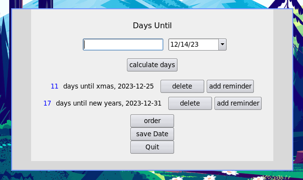
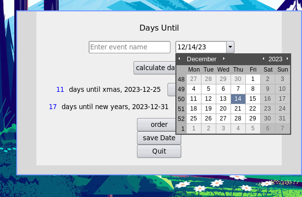

# Days Until 📅

## Intro

 Whether it be a school or work assignment 🎯, or an event like a holiday, we tend to overstimate how much time we have to prepare for those events 📅.

This program aims to solve exactly this problem, the problem of important dates in the future seeming further away than they are.

In this program you can see how much time there is left, you can save those events, order them by proximity, and delete them when you no longer need
them.

## Details

This is GUI python app using Tkinter. The dates are stored as key value pairs in a csv file.
